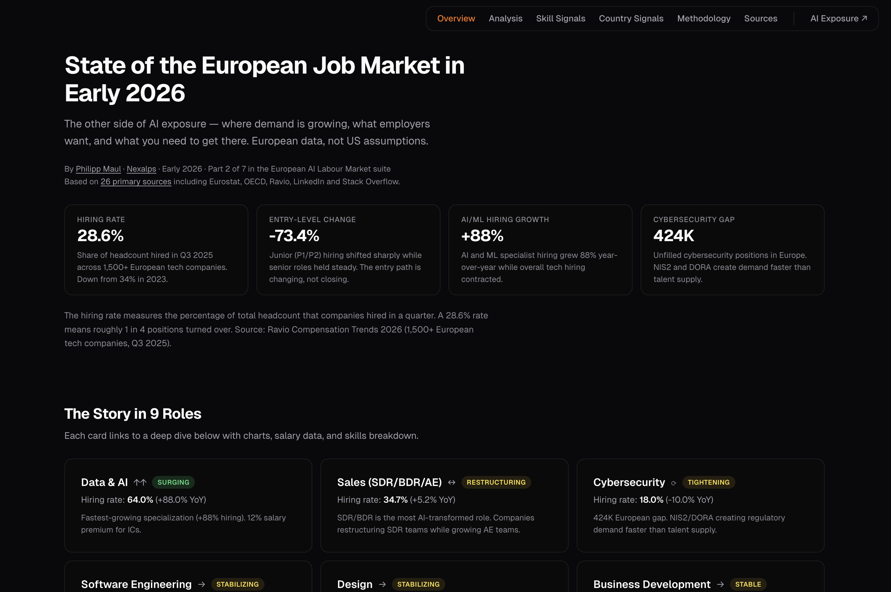

# State of the European Job Market in Early 2026

Career intelligence for 9 tech role families across 34 European countries. Part 2 of 7 in the European AI Labour Market suite. Companion to the [AI Exposure Map](https://github.com/Ph1lM4/ai-job-impact-europe).

**What makes this different:** European data, not US assumptions. Every number traces to one of 26 primary sources including Ravio (1,500+ EU tech companies), Eurostat, LinkedIn, Stack Overflow, and OECD. Hiring rates, salary growth by country, seniority shifts, AI premium, and skills that protect.



## Live Site

**[job-market.nexalps.com →](https://job-market.nexalps.com)** *(static site, no backend)*

## What's Included

| Page | Description |
|------|-------------|
| [Overview](https://job-market.nexalps.com/) | 9 role families with hiring trends, salary data, seniority charts, and skills breakdown |
| [Analysis](https://job-market.nexalps.com/analysis.html) | 4 signals reshaping the European job market: seniority shift, AI premium, regulatory demand, geographic divergence |
| [Skill Signals](https://job-market.nexalps.com/skills.html) | Research-backed skills matrix, trajectories, and protection pairs across all 9 roles |
| [Country Signals](https://job-market.nexalps.com/countries.html) | 34 European markets with AI adoption, ICT workforce, developer salaries, employment trends |
| [Methodology](https://job-market.nexalps.com/methodology.html) | Data sources, tier ratings, limitations, and connection to the AI Exposure Map |
| [Sources](https://job-market.nexalps.com/sources.html) | Complete bibliography of all 26 primary sources |
| [llms.txt](https://job-market.nexalps.com/llms.txt) | Machine-readable project summary |

## Key Findings

- **28.6%** overall hiring rate (down from 34% in 2023)
- **-73.4%** entry-level (P1/P2) hiring collapse while senior roles held steady
- **+88%** AI/ML specialist hiring growth year-over-year
- **424K** unfilled cybersecurity positions in Europe
- **12%** salary premium for AI-fluent individual contributors
- **5.0%** median salary increase for second consecutive year
- Germany is the only major Western European market with positive hiring growth (+2.8%)

## The 9 Role Families

| Role | Status | Hiring Rate | Key Signal |
|------|--------|-------------|------------|
| Data & AI | Surging | 64.0% (+88%) | Fastest-growing specialization |
| Sales (SDR/BDR/AE) | Restructuring | 34.7% (+5.2%) | AE growing, SDR shrinking |
| Cybersecurity | Tightening | 18.0% (-10%) | 424K gap, regulatory demand |
| Software Engineering | Stabilizing | 20.7% (-1.4%) | Lowest attrition at 12% |
| Design | Stabilizing | 21.0% (-4.5%) | 73% require AI fluency |
| Business Development | Stable | 34.7% | Partnership-led GTM growing |
| Product Management | Contracting | 20.6% (-14.2%) | Entry-level PM down 73% |
| Growth & Marketing | Contracting | 21.8% (-16.2%) | Budget up, headcount down |
| Operations | Squeezed | 27.1% (-20.3%) | Highest attrition, lowest tenure |

## Tech Stack

- **Pure HTML/CSS/JavaScript** — no framework, no build step
- **D3.js v7** for interactive charts (hiring trends, seniority bars, salary comparisons)
- **PostHog** for privacy-friendly analytics (EU-hosted)
- **Netlify** for hosting with custom headers and caching
- **Geist** font from Google Fonts

## The Suite

This is Part 2 of 7 in the European AI Labour Market suite:

1. **[AI Exposure Map](https://ai-exposure.nexalps.com)** — AI exposure scores for ~130 occupation groups
2. **[Job Market](https://job-market.nexalps.com)** — Hiring trends and career intelligence *(this repo)*
3. *Coming soon*
4. *Coming soon*
5. *Coming soon*
6. *Coming soon*
7. *Coming soon*

## Preview Locally

```bash
cd site && python3 -m http.server 8091
# Open http://localhost:8091
```

## Data Sources

26 primary sources across 3 tiers:

| Tier | Definition | Examples |
|------|------------|---------|
| Tier 1 | Official statistics or large-sample research (n > 1,000) | Eurostat, OECD, Ravio, LinkedIn, Stack Overflow, ISC2 |
| Tier 2 | Industry reports with documented methodology | Atomico, Figma, Bridge Group, McKinsey, Hays, Signium |
| Tier 3 | Expert analysis or small-sample surveys | Indeed Hiring Lab, Bitkom, LinkedIn working papers |

## License

**Dual-licensed:**

- **Code** (`site/*.html`, `site/*.css`, `site/*.js`): [MIT](https://opensource.org/licenses/MIT)
- **Data and analysis** (`site/job-market-data.json`, narrative text): [CC-BY 4.0](https://creativecommons.org/licenses/by/4.0/) — Philipp Maul | Nexalps

## Author

Built by [Philipp Maul](https://www.linkedin.com/in/pmaul/) at [Nexalps](https://nexalps.com).
